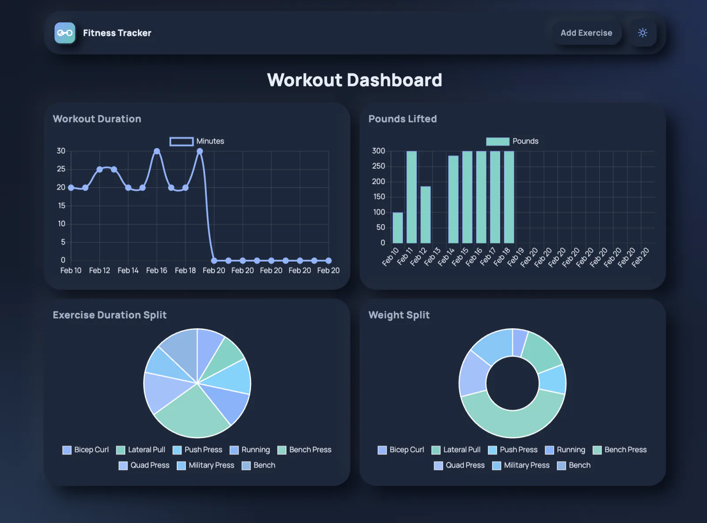

# Workout Tracker

### Track workouts fast, stay consistent, and actually see your progress in a clean dashboard

Workout Tracker is a full-stack fitness logging app for recording daily workouts and exercises with a simple flow. You can add cardio or resistance exercises, continue the latest workout, and review progress in charts without dealing with extra setup noise.

---

## ✨ Features

| | Feature | What It Does |
|---|---|---|
| 📝 | Quick Workout Logging | Create a workout and add exercises in a few clicks with a beginner-friendly UI. |
| 🏋️ | Cardio + Resistance Support | Tracks the right fields for each exercise type (sets/reps/weight or distance/duration). |
| 🔁 | Continue Last Workout | Automatically resumes the latest workout so you can keep adding exercises. |
| 📊 | Progress Dashboard | Chart.js visualizations show duration, weight totals, and exercise splits. |
| 🌗 | Theme Toggle | Light/dark theme support with saved preference and chart refresh on theme change. |
| 📱 | Responsive Frontend | Works across desktop and mobile layouts with a polished static frontend. |

---

<p align="center">
  
</p>

---

## 🛠️ Tech Stack


---

## 🧩 Project Snapshot

- Express server serves the static frontend from `public/` and exposes REST endpoints for workout data.
- MongoDB + Mongoose models: `Workout` stores workout dates and exercise references, `Exercise` stores exercise details.
- API routes in `routes/api-routes.js` create workouts, append exercises, and return workout ranges for charts.
- Frontend pages: home (`/`), exercise entry (`/exercise`), and dashboard (`/stats`) using vanilla JS.
- Seeder script (`npm run seed`) populates sample workouts and exercises for local testing.
- Deployment-ready basics are in place: `PORT` and `MONGODB_URI` environment variable support.

---

## 🚀 Live Demo


[](https://github.com/jorguzman100/workout-tracker)

No public deployment yet. Local run is ready now, and the app is set up to use environment variables later for deployment.

---

## 💻 Run it locally

```bash
git clone https://github.com/jorguzman100/workout-tracker.git
cd workout-tracker
npm install
cp .env_example .env # optional local reference file
npm start
```

Optional: seed sample workout data

```bash
npm run seed
```

Local URL:

- App + API: `http://localhost:3000`

<details>
<summary>🔑 Required environment variables</summary>

```env
# .env (reference file for local setup)
PORT=3000
MONGODB_URI=mongodb://127.0.0.1:27017/workout
```

Notes:

- No third-party API keys are required for this project.
- The app reads environment variables from the runtime/deployment platform.
- `.env_example` is included as a setup reference and starter file.
</details>

---

## 🤝 Contributors

- **Jorge Guzman**  ·  [@jorguzman100](https://github.com/jorguzman100)
